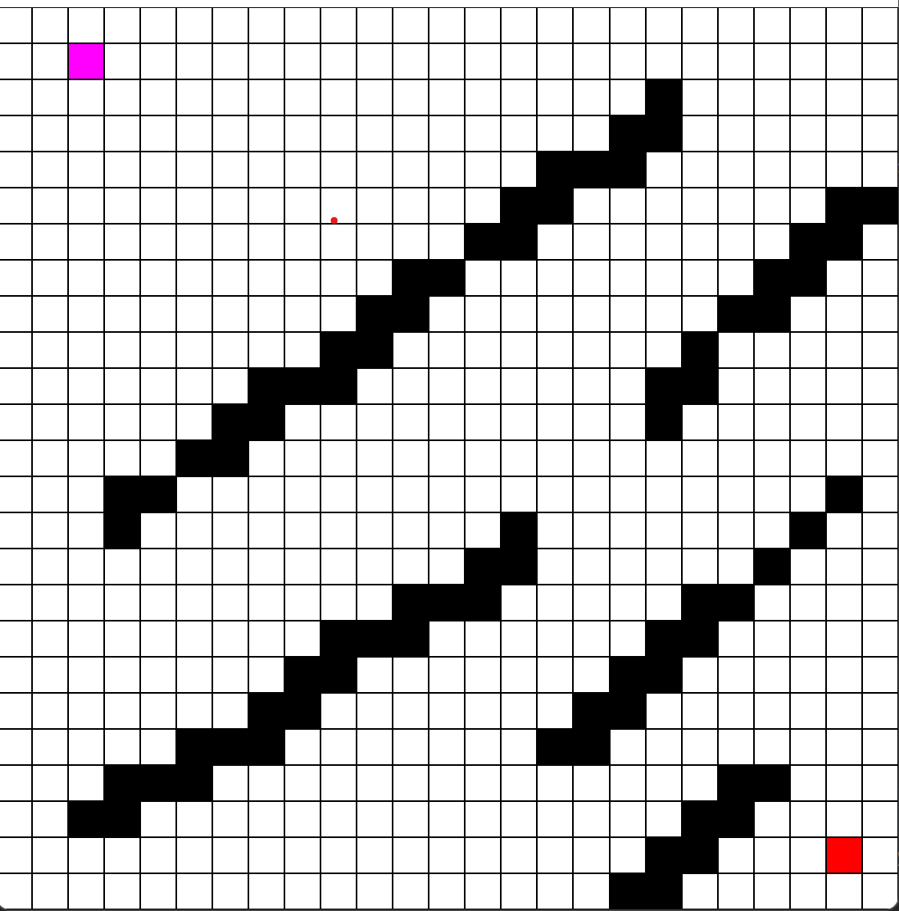
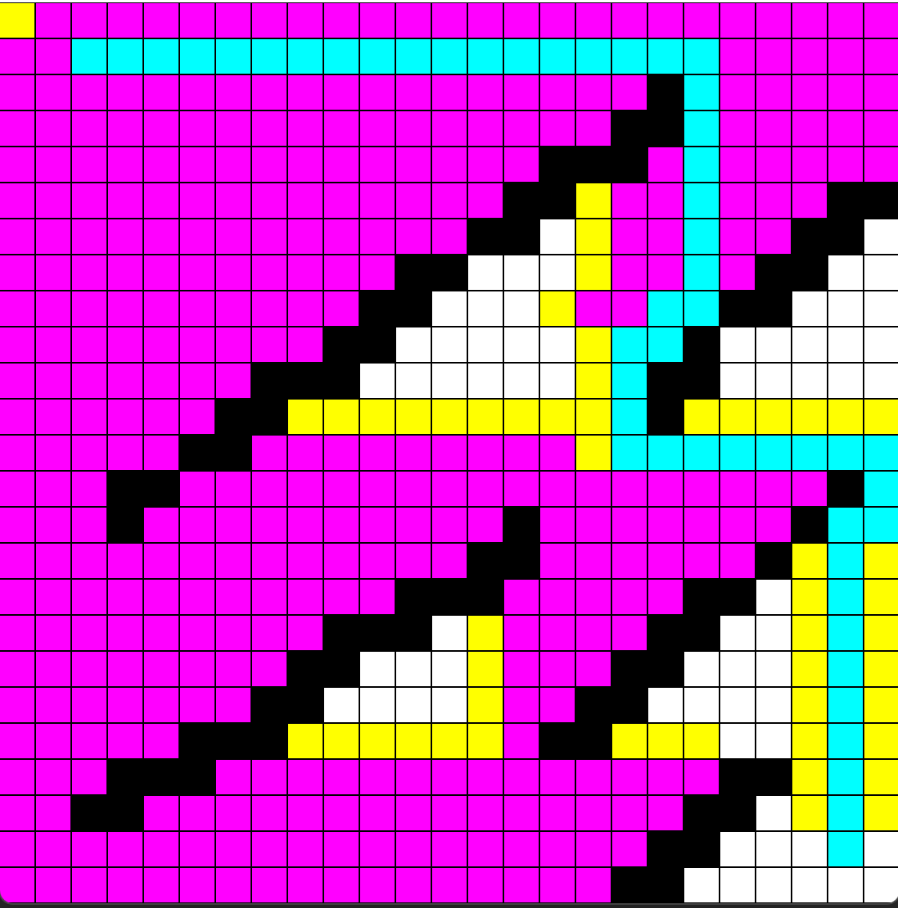
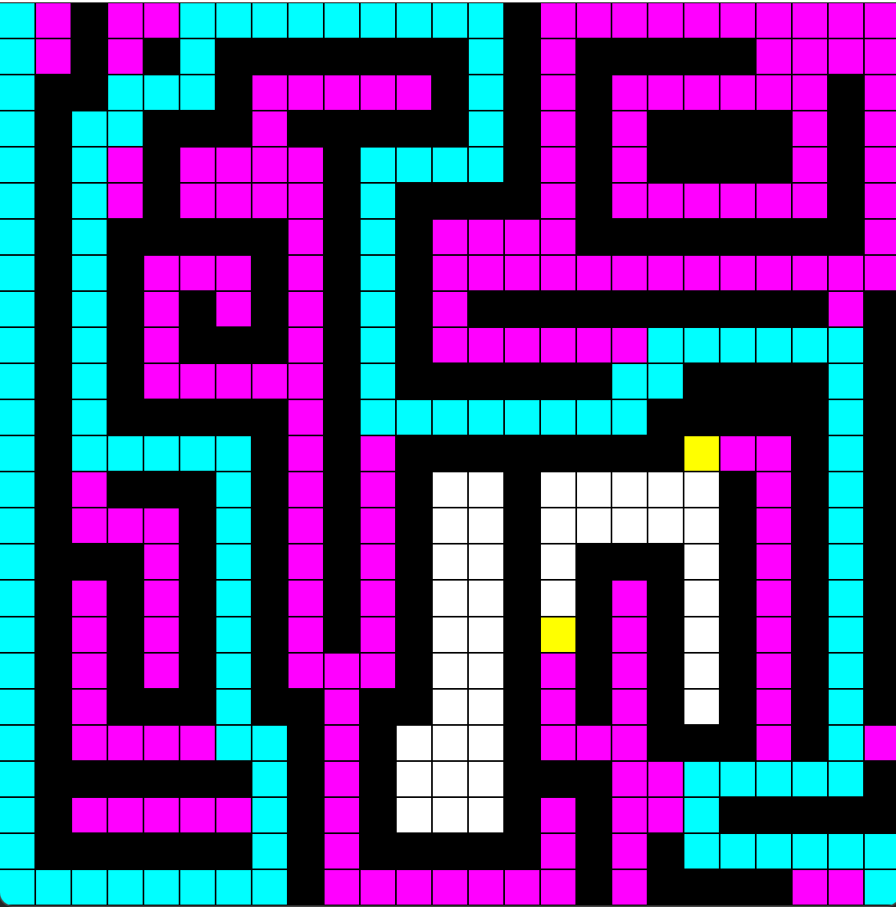

# Pathfinding Visualizer

## Description
This program utilizes different pathfinding algorithms from graph theory to find the shortest path from one node to another. Some of the algorithms used are Dijkstra's, A*, and Breath First search. The program is written completely in java utilizing the built in graphics api. The drawing of the panel is done in the graphics thread, which all the computations are done in a separate thread. There are synchronization blocks throughout the computation thread as well as the drawing thread to ensure there are no race conditions, which was one of the problems that occured during implementation.

## How to run program:
1. Open Pathfinding folder in Intelij and press run
2. Select the size and type of pathfinding algorithm
3. Key Commands
   - s: Place start node
   - e: Place end node
   - w: place walls
   - Enter: Run the selected pathfinding algorithm
4. When program is running, colors will appear to represent the following:
   - Magenta: found and selected node
   - Yellow:  found but not selected node
   - BLUE: Represents the path found by the algorithm

## Future Changes:
1. Window on right of GUI explaining the key controls
2. More Pathfinging Algorithms
## Images of program running
<table style="border: none">
  <tr>
    <td valign="top"></td>
    <td valign="top"></td>
    <td valign="top"></td>
   </tr>
</table>

